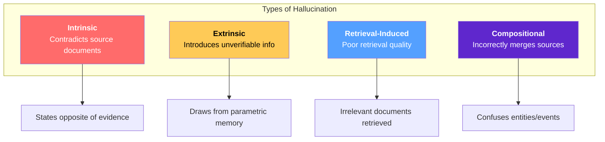
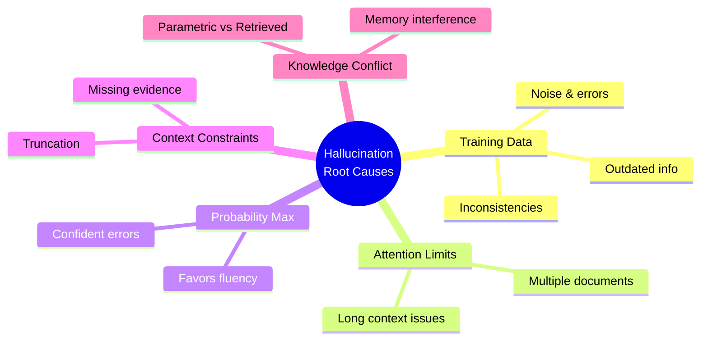
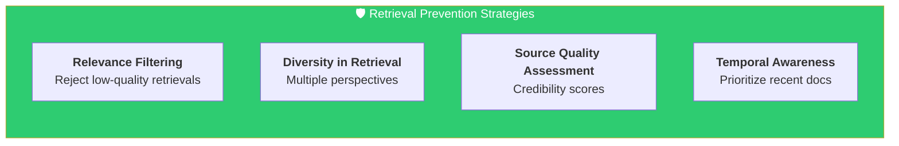
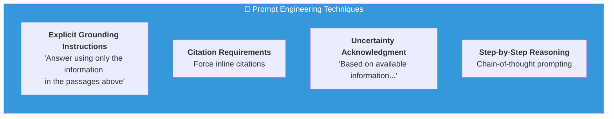
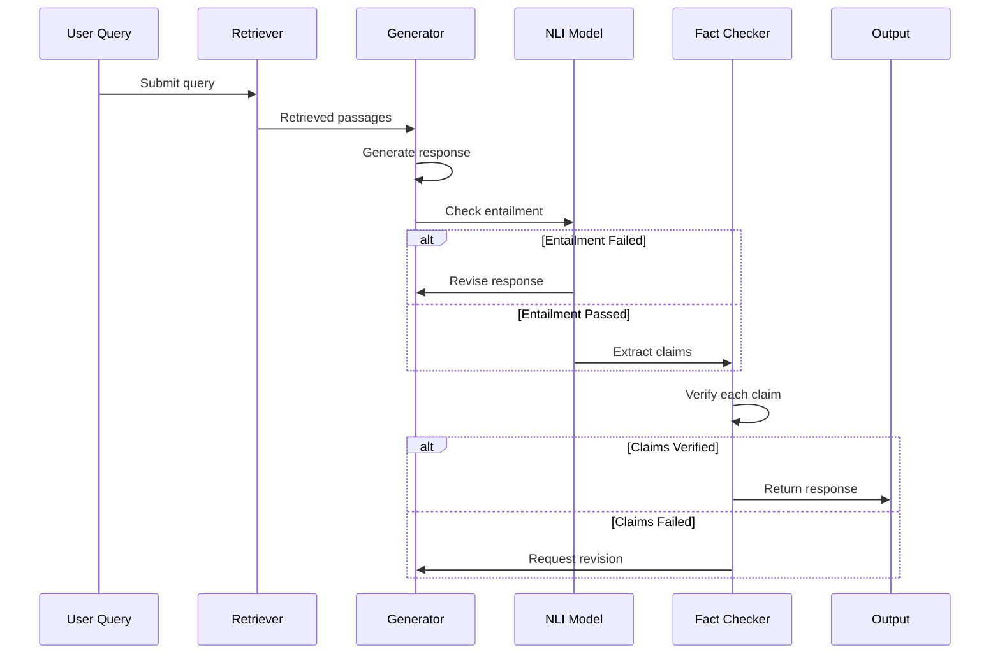
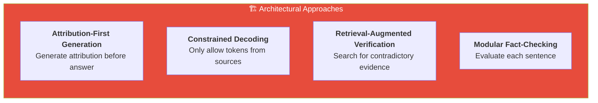
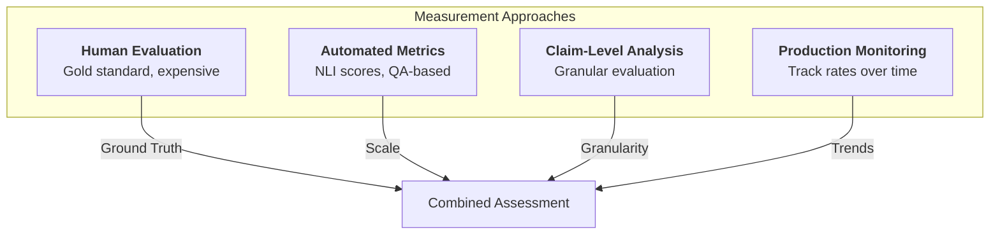
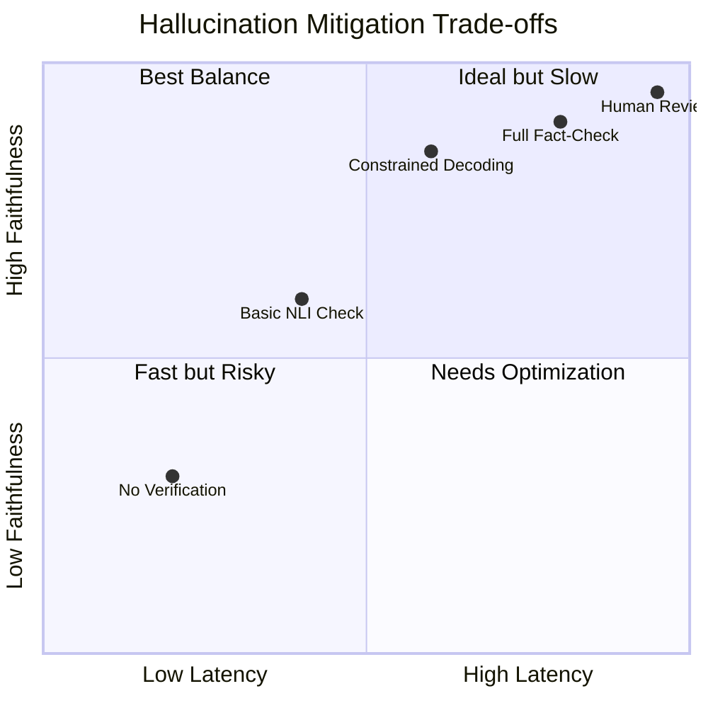
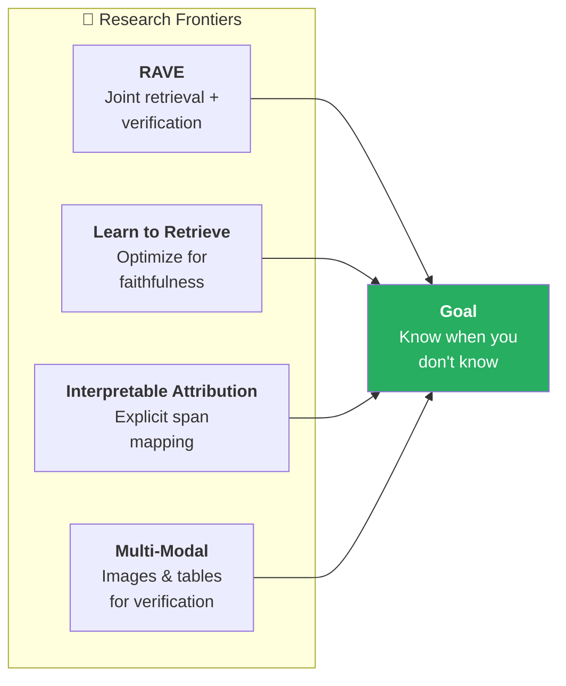

# Hallucination Mitigation Strategies in RAG Systems

## Understanding Hallucination in Language Models

Hallucination refers to the phenomenon where language models generate content that is factually incorrect, nonsensical, or unfaithful to provided source material. Despite RAG's promise of grounding LLM outputs in retrieved evidence, hallucination remains a significant challenge. This document explores the causes of hallucination and strategies for mitigation.

---

## Types of Hallucination in RAG Systems

*Figure 1: The four main types of hallucination in RAG systems, each with distinct causes and manifestations.*

### Intrinsic Hallucination
Occurs when the generated output contradicts the provided source documents. The model might state the opposite of what the evidence says or confuse details between different retrieved passages.

### Extrinsic Hallucination
Happens when the model introduces information not present in any retrieved document. While sometimes this information is correct (drawing from parametric knowledge), it cannot be verified from the provided context and may be false.

### Retrieval-Induced Hallucination
Emerges from poor retrieval quality. If retrieved documents are irrelevant or only tangentially related to the query, the model may hallucinate to produce a seemingly responsive answer.

### Compositional Hallucination
Occurs when combining information from multiple sources. The model might incorrectly merge facts about different entities or events, creating plausible-sounding but false statements.

---

## Root Causes of Hallucination

Understanding why hallucination occurs helps in designing effective mitigation strategies:

*Figure 2: Mind map showing the five primary root causes of hallucination in language models.*

**Training Data Noise:** LLMs are trained on internet text containing errors, outdated information, and inconsistencies. These patterns can resurface during generation.

**Attention Limitations:** Transformer attention mechanisms may fail to properly weight source evidence, especially in long contexts with multiple documents.

**Probability Maximization:** Language models maximize the probability of fluent, natural-sounding text. When uncertain, they may favor generating confident-sounding but incorrect statements over expressing uncertainty.

**Context Window Constraints:** When retrieved content exceeds context limits, truncation may remove crucial evidence, forcing the model to fill gaps.

**Parametric vs Non-Parametric Conflict:** The model's learned knowledge (parametric) may conflict with retrieved evidence (non-parametric), creating tension in the generation process.

---

## Prevention Through Improved Retrieval

Many hallucinations stem from retrieval failures. Improving retrieval quality directly reduces hallucination:

*Figure 3: Four key strategies for preventing hallucination through improved retrieval quality.*

**Relevance Filtering:** Set minimum similarity thresholds and reject low-quality retrievals rather than forcing the model to use irrelevant content. It's better to acknowledge "I don't have enough information" than to hallucinate.

**Diversity in Retrieval:** Retrieve documents from multiple perspectives to give the model a complete picture. Single-source retrieval can miss important context.

**Source Quality Assessment:** Not all documents are equally reliable. Incorporate source credibility scores into retrieval ranking to prioritize authoritative content.

**Temporal Awareness:** For time-sensitive queries, prioritize recent documents and flag potentially outdated information.

---

## Prompt Engineering for Grounding

The prompt significantly influences hallucination rates:

*Figure 4: Prompt engineering techniques that help ground model outputs in retrieved evidence.*

**Explicit Grounding Instructions:** Clearly instruct the model to use only provided evidence. Phrases like "Answer using only the information in the passages above" establish the expectation of faithfulness.

**Citation Requirements:** Requiring inline citations forces the model to explicitly connect claims to sources. This both improves accountability and makes hallucination more detectable.

**Uncertainty Acknowledgment:** Encourage the model to express uncertainty when evidence is insufficient. Phrases like "Based on the available information..." or "The documents don't directly address..." are preferable to confident hallucinations.

**Step-by-Step Reasoning:** Chain-of-thought prompting that requires the model to show its reasoning can surface logical errors and unsupported leaps.

---

## Output Verification and Validation

Post-generation verification catches hallucinations before they reach users:

*Figure 5: Sequence diagram showing the verification pipeline flow from query through fact-checking to final output.*

**Entailment Checking:** Use natural language inference (NLI) models to verify that generated claims are entailed by retrieved passages. Claims that contradict or are neutral with respect to sources may be hallucinated.

**Fact Extraction and Verification:** Extract factual claims from the generated response and verify each against the source documents using specialized fact-checking models.

**Self-Consistency Checking:** Generate multiple responses to the same query and check for consistency. Inconsistent responses indicate uncertainty or hallucination.

**Confidence Calibration:** Train or fine-tune models to output well-calibrated confidence scores. Low-confidence outputs can trigger additional verification or human review.

---

## Architectural Solutions

System architecture can be designed to minimize hallucination:

*Figure 6: Architectural approaches that can be built into RAG systems to minimize hallucination.*

**Attribution-First Generation:** Some architectures generate attribution (which source says what) before generating the answer. This ensures claims are explicitly grounded.

**Constrained Decoding:** Modify the generation process to only allow tokens or phrases that appear in source documents. This guarantees faithfulness but may limit fluency.

**Retrieval-Augmented Verification:** After generation, perform additional retrieval to find evidence supporting or contradicting the generated claims. Conflicting evidence triggers revision.

**Modular Fact-Checking:** Insert a fact-checking module between generation and output that evaluates each sentence against source material.

---

## Fine-Tuning Approaches

Specialized training can improve faithfulness:

| Approach | Description | Benefit |
|----------|-------------|---------|
| **Attribution Training** | Fine-tune on datasets with explicit citations | Teaches verifiable claim generation |
| **Preference Learning** | RLHF/DPO targeting hallucination | Model learns to prefer grounded outputs |
| **Contrastive Learning** | Distinguish faithful vs unfaithful | Better discrimination ability |
| **Retrieval-Aware Training** | Include retrieval during training | Proper evidence attention |

**Attribution Training:** Fine-tune models on datasets where outputs explicitly cite sources. This teaches the model to generate verifiable claims.

**Preference Learning:** Use RLHF or DPO with human feedback specifically targeting hallucination. Annotators mark faithful vs unfaithful responses, and the model learns to prefer grounded outputs.

**Contrastive Learning:** Train models to distinguish between faithful and unfaithful responses using contrastive objectives.

**Retrieval-Aware Training:** Include retrieval results during training so the model learns to properly attend to and use retrieved evidence.

---

## Human-in-the-Loop Strategies

For high-stakes applications, human oversight remains valuable:

**Confidence-Based Routing:** Automatically route low-confidence responses to human reviewers rather than displaying potentially hallucinated content.

**Sampling and Auditing:** Regularly sample and audit model outputs to identify hallucination patterns and problematic query types.

**User Feedback Integration:** Allow users to flag incorrect information and use this feedback to improve retrieval and generation.

**Domain Expert Review:** For specialized domains (medical, legal, financial), incorporate expert review processes for critical queries.

---

## Measuring Hallucination

Effective mitigation requires measurement:

*Figure 7: Four complementary approaches for measuring hallucination rates in RAG systems.*

**Human Evaluation:** Gold standard but expensive. Train annotators to identify unsupported claims by comparing outputs to source documents.

**Automated Metrics:** NLI-based scores (entailment ratio), QA-based metrics (can source answer questions about generated claims), and specialized hallucination detection models.

**Claim-Level Analysis:** Break responses into individual claims and evaluate each separately for a more granular understanding.

**Monitoring and Alerting:** Track hallucination metrics in production and alert when rates increase, which might indicate data drift or retrieval degradation.

---

## Trade-offs and Considerations

Hallucination mitigation involves trade-offs:

*Figure 8: Quadrant chart showing the trade-off between latency and faithfulness for different verification approaches.*

| Trade-off | Conservative | Aggressive |
|-----------|--------------|------------|
| **Fluency vs Faithfulness** | More faithful, less natural | More fluent, risk errors |
| **Recall vs Precision** | May miss correct info | May include hallucinations |
| **Latency vs Quality** | Faster, less checking | Slower, thorough verification |
| **Coverage vs Accuracy** | Refuses when uncertain | Attempts all queries |

The appropriate balance depends on the application domain, user expectations, and consequences of errors.

---

## Emerging Research Directions

Active research areas in hallucination mitigation include:

*Figure 9: Emerging research directions in hallucination mitigation, all converging toward systems that know their limitations.*

**Retrieval-Augmented Generation with Verification (RAVE):** End-to-end systems that jointly optimize retrieval, generation, and verification.

**Learning to Retrieve for Faithfulness:** Training retrievers specifically to find passages that enable faithful generation, not just relevant passages.

**Interpretable Attribution:** Models that explicitly show which retrieved spans support each generated claim.

**Multi-Modal Verification:** Using images, tables, and structured data to verify or refute generated text claims.

---

## Conclusion

Hallucination remains one of the most significant challenges in deploying RAG systems, particularly for applications where accuracy is critical. Effective mitigation requires a multi-layered approach combining improved retrieval, careful prompt design, output verification, and ongoing monitoring. As models and techniques continue to evolve, the goal is not just to reduce hallucination rates but to build systems that know when they don't know and communicate uncertainty appropriately.
