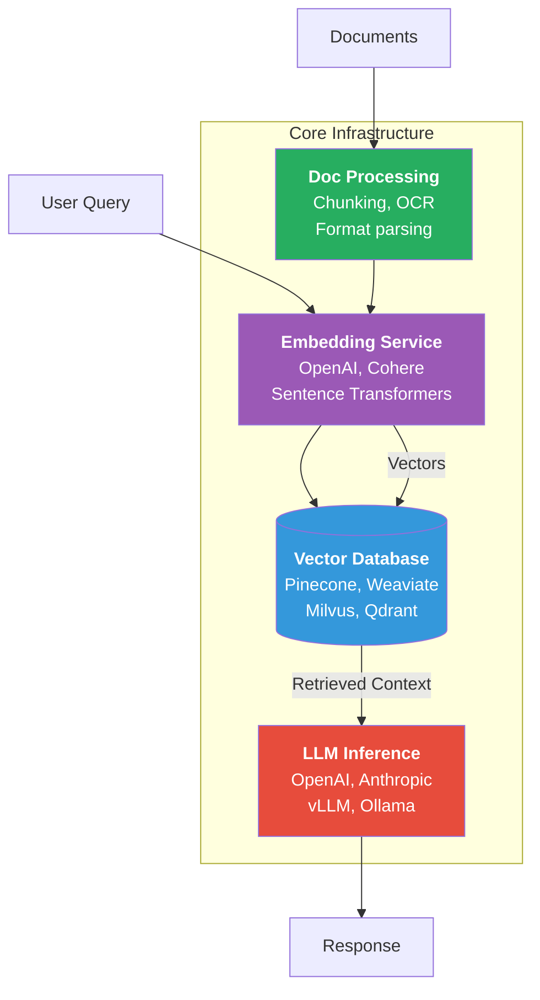
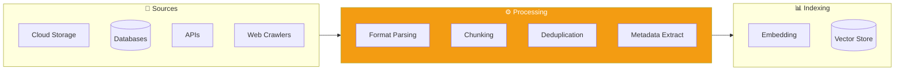
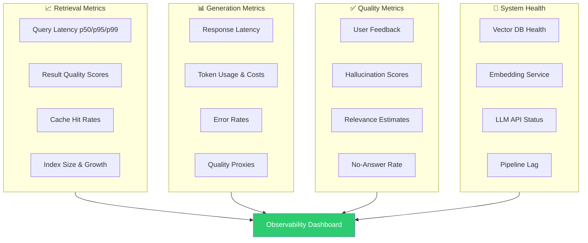
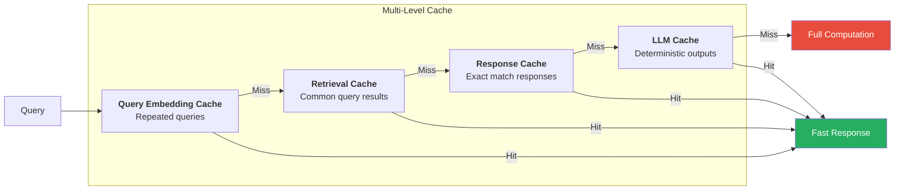
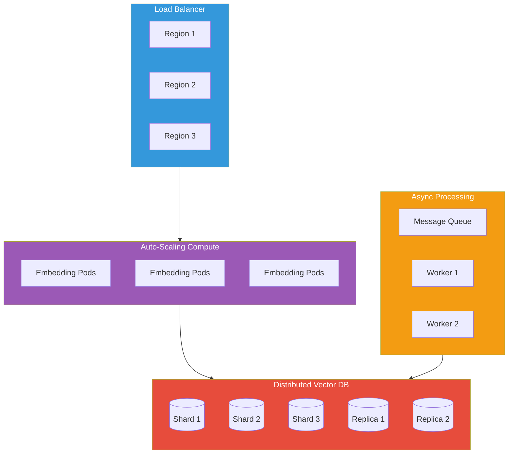
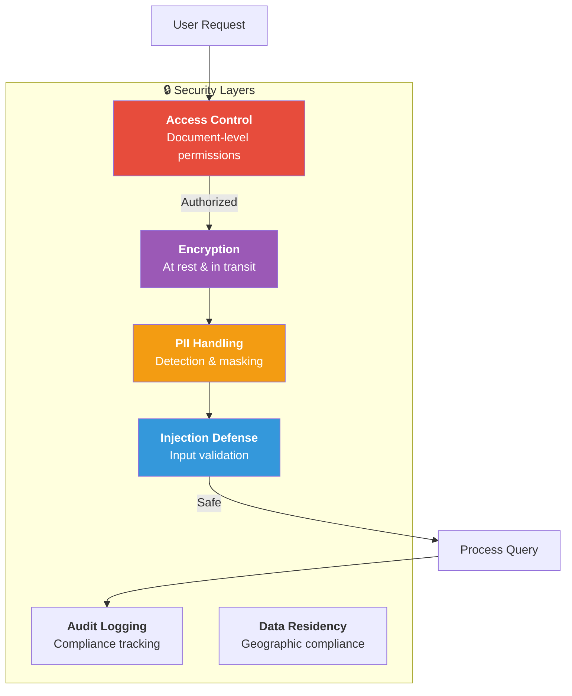
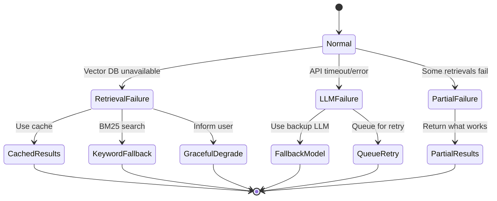
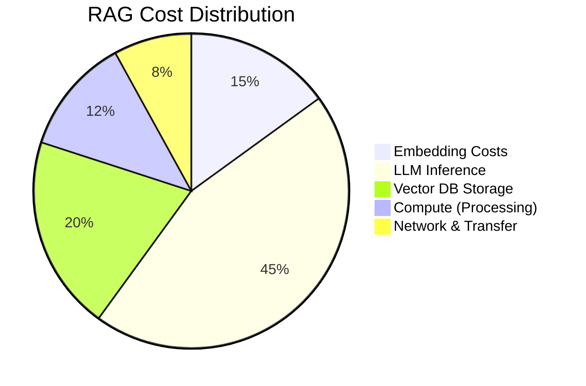
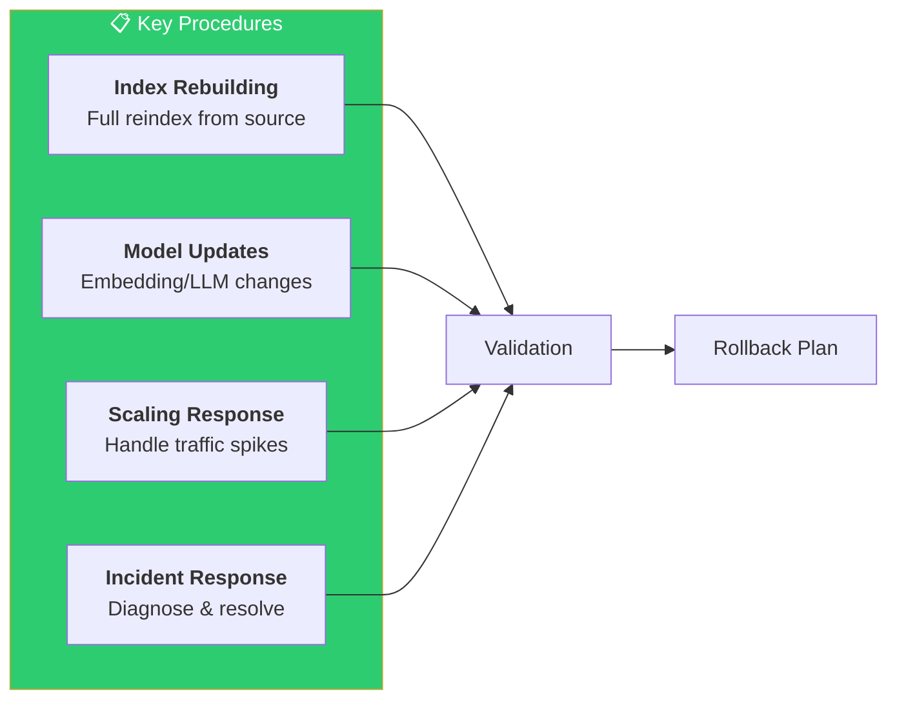

# Production RAG Deployment: Best Practices and Operational Considerations

## From Prototype to Production

Building a RAG proof-of-concept is relatively straightforward with modern frameworks. However, deploying a reliable, scalable RAG system to production involves numerous additional considerations. This document covers the operational aspects of running RAG systems in real-world environments.

---

## Infrastructure Components

A production RAG system typically requires several infrastructure components:

*Figure 1: Core infrastructure components of a production RAG system showing both query and document indexing flows.*

### Vector Database
The heart of retrieval infrastructure. Options include:
- **Managed services:** Pinecone, Weaviate Cloud, Zilliz
- **Self-hosted:** Milvus, Qdrant, Chroma, pgvector
- **Considerations:** query throughput, index size limits, filtering capabilities, cost per query

### Embedding Service
Generates vectors for documents and queries. Options:
- **API-based:** OpenAI embeddings, Cohere, Voyage AI
- **Self-hosted:** Sentence Transformers, NVIDIA NeMo
- **Considerations:** latency, cost per token, embedding quality, privacy requirements

### LLM Inference
Generates responses from retrieved context:
- **API-based:** OpenAI, Anthropic, Google, Cohere
- **Self-hosted:** vLLM, TGI, Ollama with open models
- **Considerations:** token limits, latency, cost, privacy, reliability

### Document Processing Pipeline
Ingests, chunks, and indexes documents:
- Often implemented as background jobs or event-driven pipelines
- Must handle various file formats, OCR for scanned documents
- **Considerations:** throughput, error handling, incremental updates

---

## Data Ingestion Pipeline Design

Robust document ingestion is critical for RAG quality:

*Figure 2: Data ingestion pipeline showing the flow from various sources through processing stages to the vector index.*

### Source Connectors
Build reliable integrations with document sources (cloud storage, databases, APIs, web crawlers). Handle authentication, rate limiting, and error recovery.

### Format Handling
Support multiple document formats through appropriate parsers:

| Format | Tool | Notes |
|--------|------|-------|
| PDF | pypdf, pdfplumber | Complex layouts need specialized handling |
| Office | python-docx, openpyxl | Preserves structure |
| HTML | BeautifulSoup | Remove boilerplate |
| Markdown/Plain text | Direct parsing | Straightforward |

### Chunking Strategy
Choose chunking parameters based on your content:
- Technical documentation often benefits from larger chunks preserving code blocks
- Conversational content may work better with smaller, sentence-level chunks
- Consider metadata-aware chunking that respects document structure

### Deduplication
Prevent duplicate content from diluting retrieval quality. Hash-based exact deduplication and embedding-based near-duplicate detection help maintain a clean index.

### Metadata Extraction
Extract and store metadata (source, date, author, category) to enable filtered retrieval and source attribution.

---

## Monitoring and Observability

Production systems require comprehensive monitoring:

*Figure 3: Four categories of metrics that feed into a production RAG observability dashboard.*

### Retrieval Metrics
- Query latency percentiles (p50, p95, p99)
- Retrieval result count and quality scores
- Cache hit rates
- Index size and growth rate

### Generation Metrics
- Response latency
- Token usage and costs
- Error rates by error type
- Generation quality proxies (length, citation count)

### Quality Metrics
- User feedback (thumbs up/down, ratings)
- Hallucination detection scores
- Response relevance estimates
- No-answer rate (when system appropriately declines)

### System Health
- Vector database health and capacity
- Embedding service availability
- LLM API reliability and rate limit status
- Document ingestion pipeline lag

### Logging and Tracing
Implement detailed logging of queries, retrievals, and responses. Distributed tracing helps debug issues across the retrieval-generation pipeline.

---

## Caching Strategies

Effective caching significantly reduces costs and latency:

*Figure 4: Multi-level caching strategy showing how cache hits at any level bypass downstream computation.*

**Query Embedding Cache:** Cache embeddings for repeated or similar queries. Semantic caching can return similar queries' results for near-duplicate questions.

**Retrieval Cache:** Cache retrieval results for common queries. Time-bound cache invalidation ensures freshness.

**Response Cache:** Cache complete responses for exact query matches. Be careful with personalized responses that shouldn't be cached.

**LLM Response Cache:** Some LLM providers support caching for deterministic responses. For non-deterministic generation, consider caching only the retrieved context.

**Cache Invalidation:** Design clear invalidation strategies when documents update. Consider versioning chunks and tracking which cached responses depend on which chunks.

---

## Scaling Considerations

Plan for growth in queries, documents, and users:

*Figure 5: Scalable RAG architecture with load balancing, auto-scaling compute, distributed storage, and async processing.*

**Horizontal Scaling:** Vector databases should support horizontal scaling for both storage and query throughput. Ensure your chosen solution meets projected growth.

**Read Replicas:** For read-heavy workloads, deploy vector database replicas across regions for lower latency and higher availability.

**Index Sharding:** Very large corpora may require sharding across multiple indexes. Implement routing logic to query appropriate shards.

**Async Processing:** Handle document ingestion asynchronously to avoid blocking user-facing operations. Queue-based architectures (Kafka, RabbitMQ) help manage ingestion load.

**Auto-scaling:** Configure auto-scaling for embedding services and any self-hosted inference. Traffic patterns often show significant variation.

---

## Security and Privacy

RAG systems often handle sensitive information:

*Figure 6: Security layers that requests must pass through in a production RAG system.*

**Access Control:** Implement document-level permissions. Users should only retrieve documents they're authorized to access. This requires metadata filtering during retrieval.

**Data Encryption:** Encrypt vectors at rest and in transit. Some vector databases offer encryption options; evaluate their security properties.

**PII Handling:** Establish policies for personally identifiable information. Consider PII detection and masking during ingestion.

**Prompt Injection Defense:** RAG systems are vulnerable to prompt injection through retrieved documents. Implement input validation and consider separating system prompts from retrieved content.

**Audit Logging:** Log access patterns for compliance requirements. Track which documents were retrieved for which queries by which users.

**Data Residency:** For regulated industries, ensure data remains in appropriate geographic regions. Choose vector database deployments accordingly.

---

## Evaluation and Testing

Continuous evaluation maintains quality:

| Type | Purpose | Frequency |
|------|---------|-----------|
| **Retrieval Evaluation** | Measure P@k, R@k, nDCG | Weekly |
| **End-to-End Testing** | Complete query-response flows | Daily |
| **Regression Testing** | Ensure no quality degradation | On deployment |
| **A/B Testing** | Measure real-world impact | Continuous |
| **Red Teaming** | Find vulnerabilities | Monthly |

**Retrieval Evaluation:** Maintain a test set with relevance labels. Regularly measure precision@k, recall@k, and nDCG. Track trends over time.

**End-to-End Evaluation:** Test complete query-response flows against expected answers. Automated evaluation with LLM-as-judge can scale assessment.

**Regression Testing:** When updating models or indexes, run regression tests to ensure quality doesn't degrade.

**A/B Testing:** Test changes (new embedding models, chunking strategies, prompts) against production traffic to measure real-world impact.

**Red Teaming:** Regularly probe the system for vulnerabilities, edge cases, and failure modes.

---

## Document Updates and Freshness

Keep your knowledge base current:

**Incremental Updates:** Support adding and updating documents without full reindexing. Track document versions and update only changed chunks.

**Deletion Handling:** Properly remove deleted documents from the index. Soft deletes allow recovery; hard deletes ensure data removal compliance.

**Freshness Metadata:** Track document timestamps and source update frequencies. Some applications should prefer recent documents.

**Update Notifications:** Inform downstream systems when significant updates occur. Users may need to be notified when information they previously received has changed.

**Reconciliation:** Periodically reconcile the index with source systems to catch missed updates or deletions.

---

## Failure Handling and Resilience

Production systems must handle failures gracefully:

*Figure 7: State diagram showing failure modes and recovery paths in a resilient RAG system.*

**Retrieval Failures:** When vector database is unavailable, implement fallback strategies. Options include cached results, keyword search fallback, or graceful degradation messaging.

**LLM Failures:** Handle rate limits, timeouts, and errors from LLM providers. Consider fallback models or queue-based retry mechanisms.

**Partial Failures:** Design for scenarios where some retrievals succeed but others fail. Return partial results with appropriate caveats.

**Circuit Breakers:** Implement circuit breakers to prevent cascade failures. Temporarily disable failing components rather than overwhelming them.

**Disaster Recovery:** Maintain backups of vector indexes and document stores. Document and test recovery procedures.

---

## Cost Optimization

RAG systems can become expensive at scale:

*Figure 8: Typical cost distribution in a production RAG system, with LLM inference being the largest expense.*

| Area | Strategy |
|------|----------|
| **Embedding Costs** | Batch operations, cache results |
| **LLM Costs** | Context compression, appropriate model size |
| **Storage Costs** | Tiered storage, vector compression |
| **Query Optimization** | Metadata filtering, query routing |
| **Long-term** | Committed use discounts |

**Embedding Costs:** Batch embedding operations and cache results. Choose embedding models that balance quality and cost.

**LLM Costs:** Minimize prompt sizes through context compression. Choose appropriate model sizes for different query complexities.

**Storage Costs:** Implement tiered storage for old or infrequently accessed documents. Compress vectors where supported.

**Query Optimization:** Use metadata filtering to reduce the search space. Implement query routing to avoid unnecessary retrievals.

**Commitment Discounts:** For predictable workloads, committed use discounts from cloud providers can significantly reduce costs.

---

## Operational Runbooks

Document procedures for common operational tasks:

*Figure 9: Key operational runbooks that every production RAG team should document and maintain.*

**Index Rebuilding:** Steps to rebuild the vector index from source documents, including validation and switchover procedures.

**Model Updates:** Process for updating embedding or generation models, including evaluation and rollback procedures.

**Scaling Responses:** Procedures for handling traffic spikes, including manual scaling and capacity planning.

**Incident Response:** Steps for diagnosing and resolving common issues like degraded retrieval quality or elevated error rates.

---

## Conclusion

Production RAG deployment requires careful attention to infrastructure, monitoring, security, and operations. The challenges extend well beyond the core retrieval and generation logic to encompass all aspects of running a reliable, scalable system. Organizations should plan for these operational requirements from the start, investing in appropriate infrastructure and processes to ensure their RAG systems deliver consistent value to users.
