# RAG Architectures and Design Patterns for Production Systems

## Overview of RAG System Architecture

A production RAG system consists of several interconnected components working together to transform user queries into grounded, accurate responses. Understanding these architectural patterns is crucial for building systems that are scalable, maintainable, and effective. This document explores common architectures ranging from simple pipelines to sophisticated multi-agent systems.

---

## The Basic RAG Pipeline

The simplest RAG architecture follows a linear pipeline:

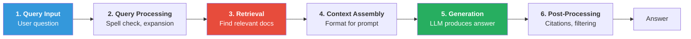

*Figure 1: The basic six-stage RAG pipeline from user query to final answer.*

1. **Query Input:** User submits a natural language question
2. **Query Processing:** Optional steps like spell correction, expansion, or reformulation
3. **Retrieval:** Finding relevant documents from the knowledge base
4. **Context Assembly:** Formatting retrieved documents into a prompt
5. **Generation:** LLM produces an answer based on query and context
6. **Post-processing:** Citation formatting, safety filtering, response validation

This basic pipeline works well for straightforward question-answering but struggles with complex queries requiring multi-step reasoning or diverse information sources.

---

## Naive RAG vs Advanced RAG

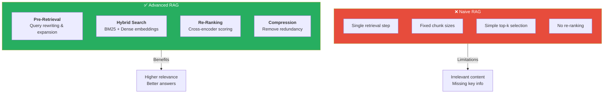

*Figure 2: Comparison of naive RAG limitations versus advanced RAG enhancements and their outcomes.*

Naive RAG implementations make several simplifying assumptions that limit their effectiveness. They typically use a single retrieval step, fixed chunk sizes, and simple top-k selection without re-ranking. While easy to implement, naive RAG often retrieves irrelevant content and produces answers that miss key information.

### Advanced RAG Enhancements

**Pre-retrieval Optimization:** Query rewriting expands or reformulates the user's question to improve retrieval. For example, "What causes global warming?" might be expanded to "What are the main causes and contributing factors to global warming and climate change?"

**Retrieval Enhancement:** Hybrid search combines keyword-based methods (BM25) with semantic search (dense embeddings). This captures both exact matches and conceptually related content.

**Post-retrieval Processing:** Re-ranking with cross-encoders scores each query-document pair for relevance. Compression removes redundant or irrelevant portions of retrieved content.

---

## Modular RAG Architecture

The modular approach decomposes RAG into pluggable components:

```mermaid
flowchart TB
    subgraph Loaders["📄 Document Loaders"]
        PDF[PDF]
        HTML[HTML]
        MD[Markdown]
        DB[(Database)]
    end
    
    subgraph Splitters["✂️ Text Splitters"]
        CHAR[Character-based]
        SENT[Sentence-based]
        REC[Recursive]
        SEM[Semantic clustering]
    end
    
    subgraph Embeddings["🔢 Embedding Models"]
        MINI[MiniLM]
        OAI[OpenAI]
        COHERE[Cohere]
    end
    
    subgraph Stores["💾 Vector Stores"]
        FAISS[FAISS]
        PINE[Pinecone]
        WEAV[Weaviate]
        CHROMA[Chroma]
    end
    
    subgraph Retrievers["🔍 Retrievers"]
        SPARSE[Sparse]
        DENSE[Dense]
        HYBRID[Hybrid]
    end
    
    subgraph Generators["🤖 Generators"]
        GPT[GPT-4]
        CLAUDE[Claude]
        LLAMA[Llama]
    end
    
    Loaders --> Splitters --> Embeddings --> Stores
    Stores --> Retrievers --> Generators
    
    style Loaders fill:#3498db,color:#fff
    style Splitters fill:#9b59b6,color:#fff
    style Embeddings fill:#f39c12,color:#fff
    style Stores fill:#1abc9c,color:#fff
    style Retrievers fill:#e74c3c,color:#fff
    style Generators fill:#27ae60,color:#fff
```

*Figure 3: Modular RAG architecture showing pluggable components at each stage of the pipeline.*

**Document Loaders** handle various file formats (PDF, HTML, Markdown, databases) and convert them to a standard representation.

**Text Splitters** chunk documents according to different strategies: character-based, sentence-based, recursive splitting, or semantic clustering.

**Embedding Models** convert text chunks to vector representations. Options range from lightweight models like all-MiniLM-L6-v2 to larger models like OpenAI embeddings.

**Vector Stores** persist and index embeddings for efficient similarity search. Popular options include FAISS, Pinecone, Weaviate, Chroma, and Milvus.

**Retrievers** implement the search logic, potentially combining multiple strategies.

**Generators** produce the final response using retrieved context.

This modularity allows teams to upgrade individual components without redesigning the entire system.

---

## Hierarchical Retrieval Pattern

For large document collections, hierarchical retrieval improves both efficiency and relevance. The approach works in two stages:

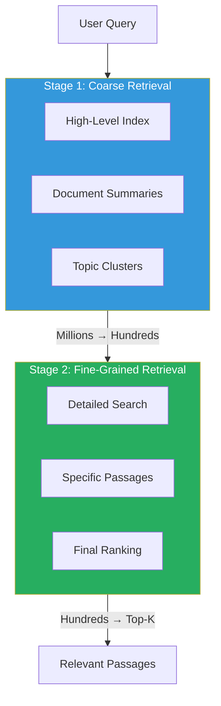

*Figure 4: Two-stage hierarchical retrieval that progressively narrows from millions of documents to top-K results.*

**First**, coarse retrieval identifies relevant document clusters or summaries from a high-level index. This quickly narrows the search space from millions of documents to hundreds.

**Second**, fine-grained retrieval searches within the selected documents to find specific relevant passages. This focuses computational resources on the most promising content.

Hierarchical retrieval is particularly effective for enterprise knowledge bases spanning thousands of documents across diverse topics.

---

## Multi-Index RAG Pattern

Different types of content benefit from different retrieval strategies. A multi-index architecture maintains separate indexes optimized for each content type:

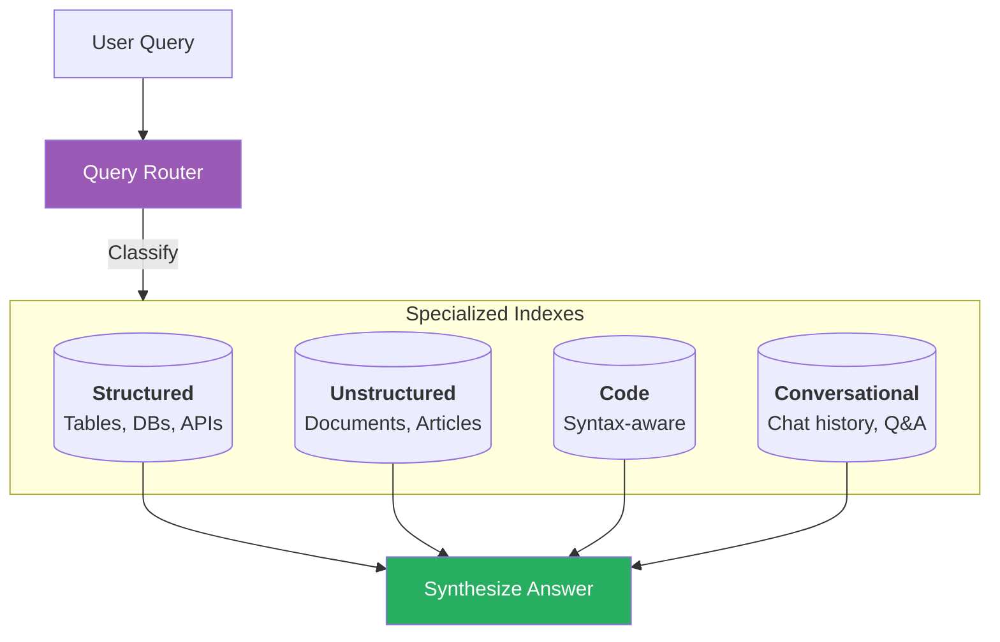

*Figure 5: Multi-index architecture with query routing to specialized indexes for different content types.*

- **Structured data index** for tables, databases, and APIs
- **Unstructured text index** for documents and articles
- **Code index** with syntax-aware chunking and search
- **Conversational index** for chat histories and Q&A pairs

A routing layer directs queries to appropriate indexes based on query classification. The final answer may synthesize information from multiple sources.

---

## Parent-Child Retrieval Pattern

Standard chunking faces a tradeoff: small chunks enable precise retrieval but lose context, while large chunks preserve context but reduce retrieval precision.

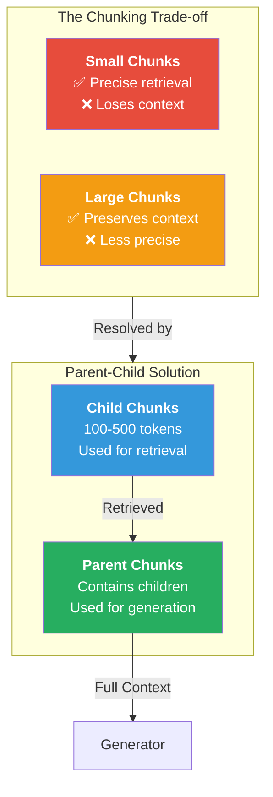

*Figure 6: Parent-child retrieval pattern that resolves the chunking trade-off between precision and context.*

The parent-child pattern resolves this tension by maintaining two granularities:

**Child chunks** (small, ~100-500 tokens) are used for embedding and retrieval. Their compact size improves embedding quality and retrieval precision.

**Parent chunks** (larger, containing multiple children) are used for generation context. When a child chunk is retrieved, the system also fetches its parent, providing the LLM with surrounding context.

This pattern improves answer quality by ensuring the generator sees complete thoughts and sections, not isolated fragments.

---

## Self-RAG Architecture

Self-RAG introduces reflection mechanisms where the LLM evaluates its own retrieval and generation:

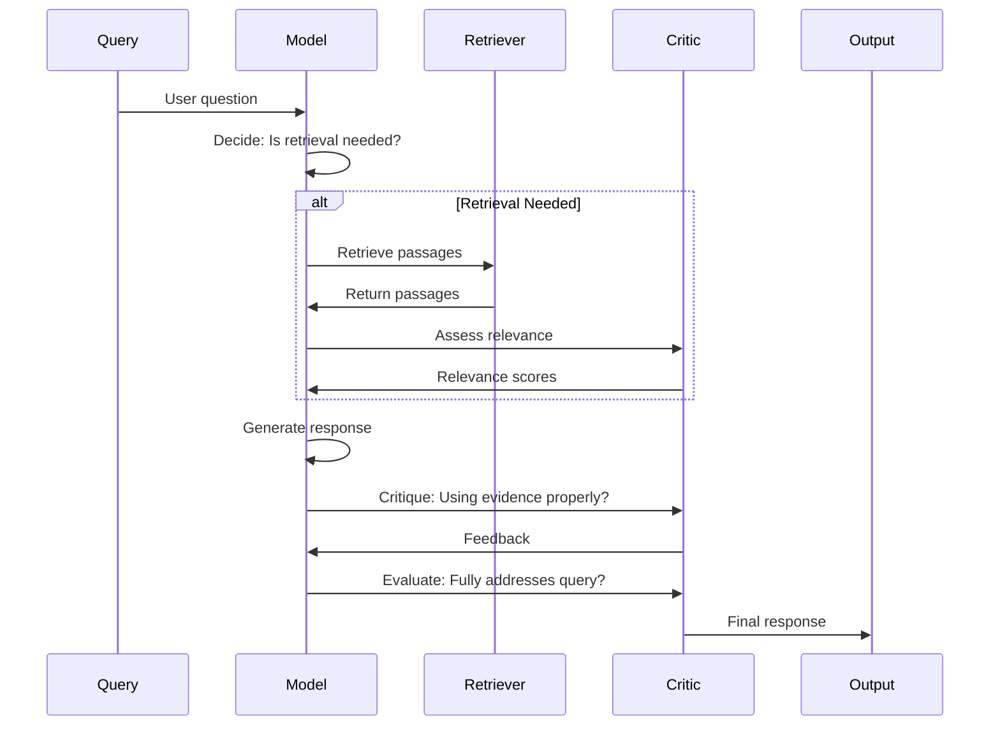

*Figure 7: Self-RAG sequence showing how the model decides on retrieval, assesses relevance, and critiques its own generation.*

1. The model decides whether retrieval is necessary for the current query
2. If retrieval is performed, the model assesses retrieved passage relevance
3. During generation, the model critiques whether it's using evidence properly
4. The model evaluates whether its response fully addresses the query

These self-reflection steps can be implemented through special tokens or separate critic models. Self-RAG improves factual accuracy and reduces hallucination by making retrieval and grounding explicit.

---

## Corrective RAG (CRAG) Pattern

CRAG addresses cases where initial retrieval fails to find relevant information:

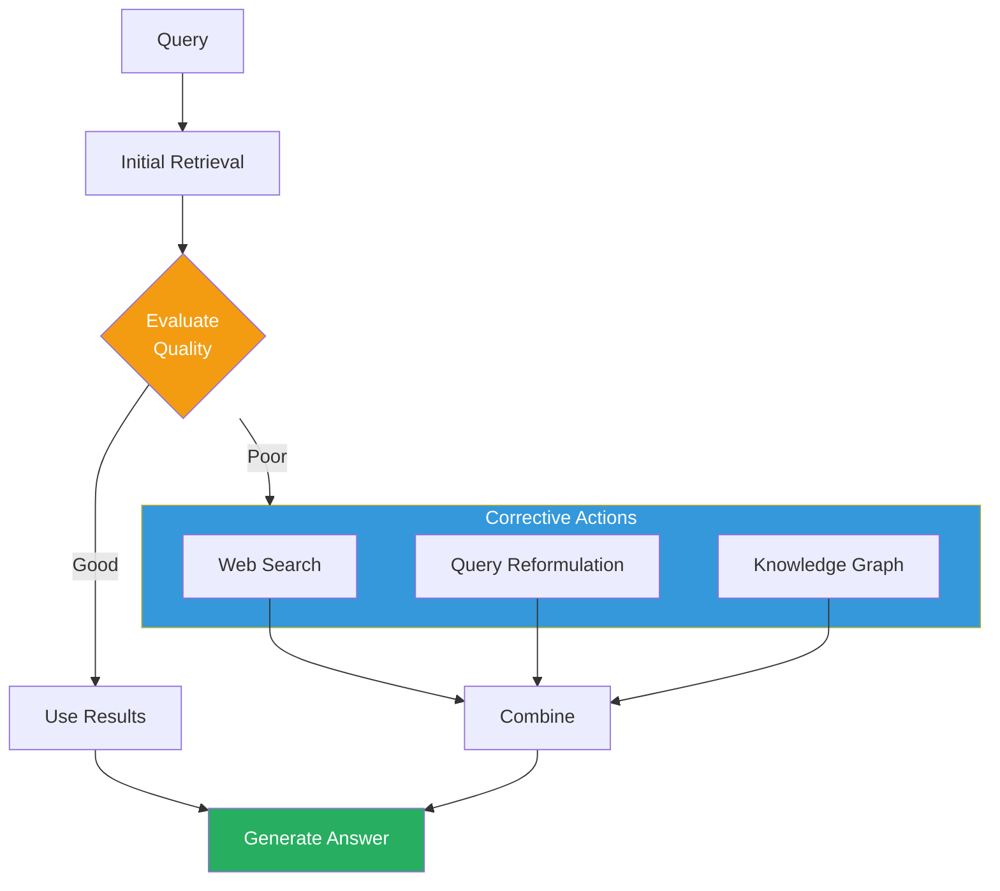

*Figure 8: Corrective RAG pattern showing how poor retrieval quality triggers fallback corrective actions.*

1. Perform initial retrieval
2. Evaluate retrieval quality (using a trained classifier)
3. If quality is poor, trigger corrective actions:
   - Web search for supplementary information
   - Query reformulation and re-retrieval
   - Knowledge graph lookup for structured facts
4. Combine or replace original results with corrective retrievals

This pattern improves robustness by having fallback mechanisms when primary retrieval fails.

---

## Agentic RAG Pattern

The most sophisticated RAG systems employ agent-based architectures where an LLM orchestrates multiple retrieval and reasoning steps:

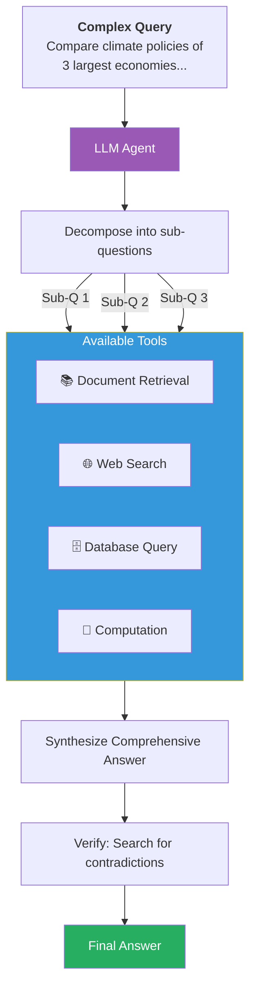

*Figure 9: Agentic RAG pattern where an LLM orchestrates query decomposition, multi-tool usage, and answer synthesis.*

The agent receives a complex query and decomposes it into sub-questions. For each sub-question, the agent decides which tools to use: retrieval, web search, database query, or computation.

After gathering information, the agent synthesizes a comprehensive answer, potentially performing additional retrieval if gaps are identified. The agent can also verify its answer by searching for contradictory evidence.

Agentic RAG excels at complex queries like "Compare the climate policies of the three largest economies and their projected impact on carbon emissions by 2030," which requires multiple retrieval steps and synthesis.

---

## Graph RAG Pattern

Graph RAG enhances retrieval by building a knowledge graph from the document corpus:

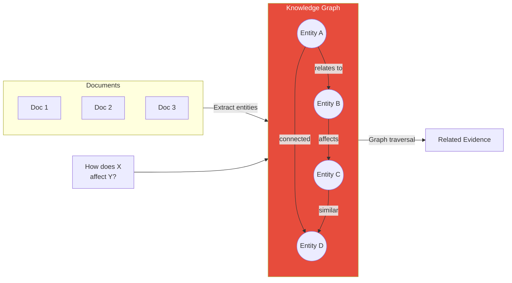

*Figure 10: Graph RAG pattern showing entity extraction from documents and relationship-based retrieval.*

Named entities are extracted from documents and connected based on co-occurrence and relationships mentioned in text. When answering a query, the system retrieves not just matching passages but also related entities and their connections.

For questions about relationships ("How does X affect Y?"), graph traversal can find relevant evidence even when no single document directly states the connection. Community detection algorithms can also identify topic clusters for hierarchical retrieval.

---

## Conversation-Aware RAG

Chatbot applications require RAG systems that maintain conversation context:

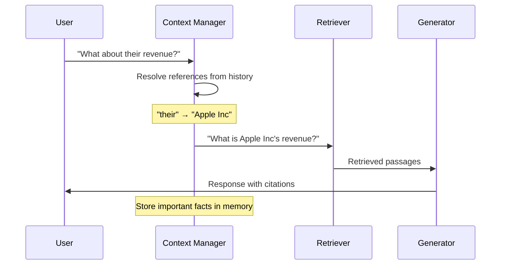

*Figure 11: Conversation-aware RAG showing reference resolution and context management across chat turns.*

**Query Contextualization:** The current query is rewritten to include relevant context from conversation history. "What about their revenue?" becomes "What is Apple Inc's revenue?" based on prior messages.

**Memory Integration:** Important facts from the conversation are stored and retrieved alongside document chunks.

**Reference Resolution:** Pronouns and references are resolved before retrieval to ensure accurate matching.

---

## Streaming and Latency Optimization

Production RAG systems must balance quality with response time:

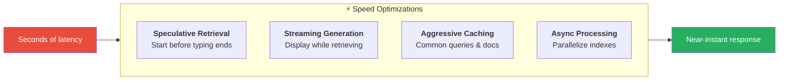

*Figure 12: Latency optimization techniques that transform multi-second delays into near-instant responses.*

**Speculative Retrieval:** Begin retrieval before the user finishes typing

**Streaming Generation:** Start generating and displaying output while retrieval completes

**Caching:** Store embeddings for common queries and frequently accessed documents

**Async Processing:** Parallelize retrieval across multiple indexes

These optimizations can reduce perceived latency from several seconds to near-instantaneous responses.

---

## Architecture Selection Guide

| Use Case | Recommended Pattern |
|----------|---------------------|
| Simple Q&A | Basic Pipeline |
| Large corpus | Hierarchical Retrieval |
| Mixed content types | Multi-Index |
| Context-sensitive answers | Parent-Child |
| High accuracy needed | Self-RAG |
| Unreliable retrieval | CRAG |
| Complex multi-step queries | Agentic RAG |
| Relationship questions | Graph RAG |
| Chatbot applications | Conversation-Aware |

---

## Conclusion

Choosing the right RAG architecture depends on your use case, scale, and quality requirements. Simple pipelines work for prototypes and limited domains. Production systems typically evolve toward modular, hierarchical, or agentic patterns as requirements grow more complex. Understanding these architectural patterns enables teams to make informed design decisions and incrementally improve their RAG systems over time.
