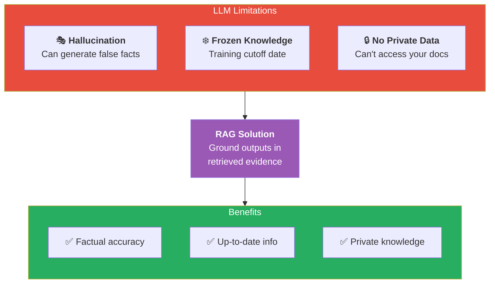
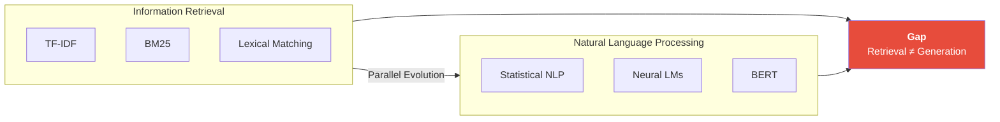
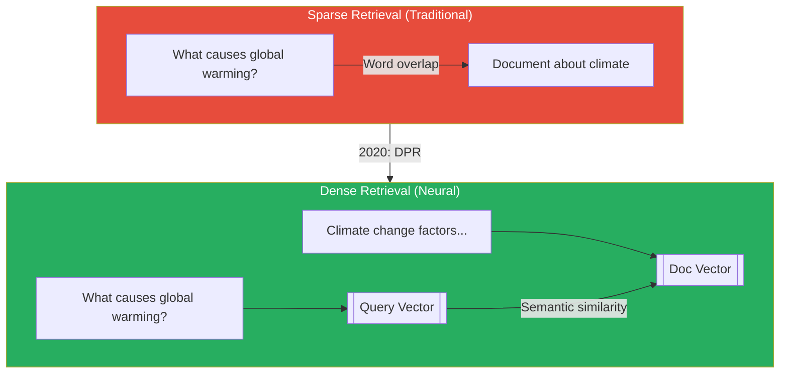
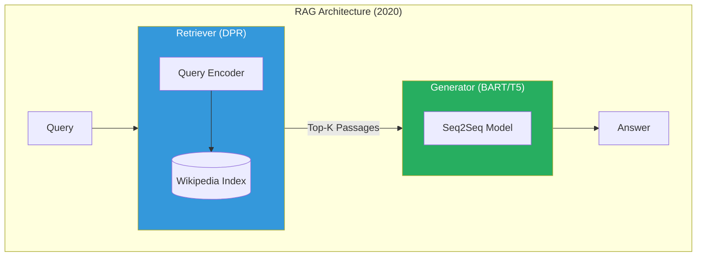
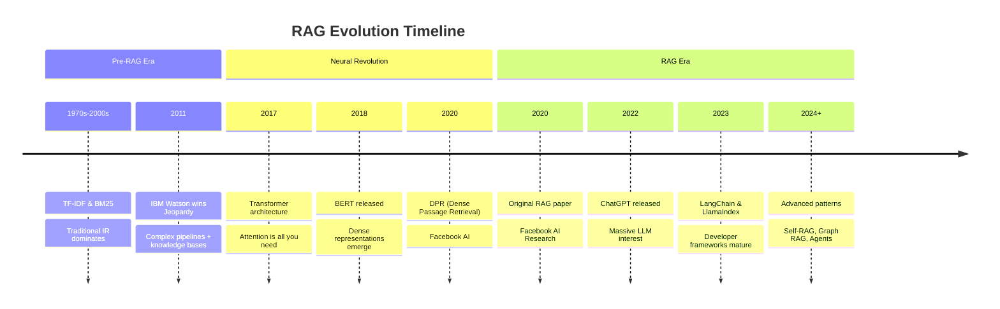
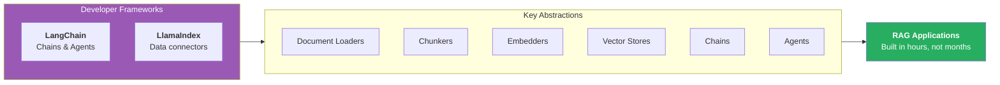
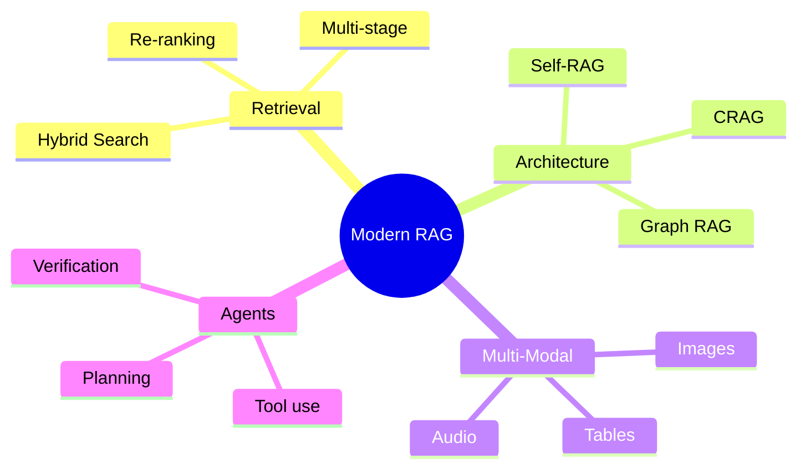
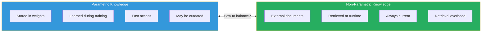

# The History and Evolution of Retrieval-Augmented Generation (RAG)

## Introduction to RAG Origins

Retrieval-Augmented Generation, commonly known as RAG, represents a paradigm shift in how we build intelligent question-answering systems. The concept emerged from the recognition that large language models (LLMs), despite their impressive capabilities, suffer from fundamental limitations: they can hallucinate facts, their knowledge is frozen at training time, and they cannot access private or recent information.

*Figure 1: The fundamental LLM limitations that RAG was designed to solve and the resulting benefits.*

The seminal paper "Retrieval-Augmented Generation for Knowledge-Intensive NLP Tasks" was published by Facebook AI Research (now Meta AI) in 2020. Authors Patrick Lewis, Ethan Perez, Aleksandra Piktus, and colleagues introduced a model that combined a pre-trained sequence-to-sequence transformer with a dense vector index of Wikipedia passages. This architecture demonstrated that retrieval could dramatically improve factual accuracy on knowledge-intensive tasks.

---

## The Pre-RAG Era: Information Retrieval Foundations

Before RAG, the fields of information retrieval (IR) and natural language processing (NLP) evolved largely in parallel. Traditional IR systems like TF-IDF and BM25 dominated search applications for decades. These systems excelled at lexical matching but struggled with semantic understanding. Meanwhile, neural language models grew increasingly powerful but remained disconnected from external knowledge sources.

*Figure 2: The parallel evolution of IR and NLP fields that eventually converged in RAG.*

Early attempts to bridge this gap included knowledge graphs and entity linking systems. IBM Watson's Jeopardy victory in 2011 showcased a complex pipeline combining structured knowledge bases with statistical NLP. However, these systems required extensive feature engineering and domain-specific ontologies.

---

## The Neural Revolution and Dense Retrieval

The introduction of transformer architectures in 2017, particularly BERT in 2018, revolutionized both retrieval and generation. Dense Passage Retrieval (DPR), also from Facebook AI, showed that learned dense representations could outperform traditional sparse retrieval methods for open-domain question answering.

*Figure 3: Comparison of sparse (word overlap) vs dense (semantic similarity) retrieval approaches.*

Dense retrieval works by encoding documents and queries into high-dimensional vector spaces where semantic similarity can be measured using distance metrics like cosine similarity or dot product. This approach captures meaning beyond surface-level word matching, enabling systems to find relevant passages even when they share few exact words with the query.

---

## The RAG Architecture Innovation

The original RAG architecture combined two key components: a retriever and a generator. The retriever, typically based on DPR, finds relevant documents from a large corpus. The generator, usually a sequence-to-sequence model like BART or T5, produces answers conditioned on both the query and retrieved passages.

*Figure 4: The original 2020 RAG architecture combining a DPR retriever with a BART/T5 generator.*

Two variants were proposed in the original paper:

| Variant | Description | Trade-off |
|---------|-------------|-----------|
| **RAG-Sequence** | Same docs for entire output | Simpler, faster |
| **RAG-Token** | Different docs per token | More flexible, costlier |

**RAG-Sequence** retrieves documents once and generates the entire output conditioned on the same set of documents. **RAG-Token** can attend to different documents for each generated token, offering more flexibility at higher computational cost.

---

## Evolution: From Research to Production

Since 2020, RAG has evolved rapidly from academic research to production systems. Several key developments have shaped this evolution:

*Figure 5: Timeline of RAG evolution from traditional IR through the neural revolution to modern advanced patterns.*

**First**, the emergence of powerful embedding models like OpenAI's text-embedding-ada-002 and open-source alternatives like Sentence Transformers democratized dense retrieval. These models could be applied out-of-the-box without task-specific fine-tuning.

**Second**, vector databases like Pinecone, Weaviate, Milvus, and Chroma emerged to handle the infrastructure challenges of storing and searching billions of embeddings efficiently. These systems provide approximate nearest neighbor search algorithms that make retrieval practical at scale.

**Third**, the release of ChatGPT in late 2022 and subsequent LLMs sparked massive interest in building conversational AI systems. RAG became the standard approach for grounding these powerful but sometimes unreliable models in factual information.

---

## The LangChain and LlamaIndex Era

Developer frameworks like LangChain and LlamaIndex emerged to simplify RAG implementation. These libraries provide abstractions for document loading, chunking, embedding, indexing, and retrieval, allowing developers to build RAG systems without deep expertise in each component.

*Figure 6: How developer frameworks provide abstractions that accelerate RAG application development.*

These frameworks also popularized patterns like chains and agents, where RAG retrieval becomes one step in a larger reasoning pipeline. For example, an agent might decide whether to retrieve information, perform calculations, or call external APIs based on the user's question.

---

## Current State and Future Directions

Today's RAG systems incorporate numerous improvements over the original architecture:

*Figure 7: Mind map of modern RAG capabilities across retrieval, architecture, multi-modal, and agentic dimensions.*

**Multi-stage retrieval** combines sparse and dense methods in hybrid approaches. **Re-ranking** with cross-encoders improves precision by scoring query-document pairs more carefully. **Query expansion and reformulation** help bridge vocabulary gaps between users and documents.

Research continues on several fronts:
- **Self-reflective RAG systems** that can evaluate their own retrieval quality
- **Multi-modal RAG** incorporating images and other media
- **Agentic RAG** that can decompose complex questions into multiple retrieval steps

---

## The Central Research Question

The field increasingly recognizes that RAG is not a single technique but a family of approaches united by the principle of augmenting generation with retrieval. As LLMs continue to improve, the interplay between parametric knowledge (stored in model weights) and non-parametric knowledge (retrieved from external sources) remains a central research question.

*Figure 8: The central research question of balancing parametric (model weights) vs non-parametric (retrieved) knowledge.*

---

## Conclusion

RAG represents the convergence of decades of progress in information retrieval and natural language processing. By combining the strengths of retrieval systems (access to vast, updateable knowledge) with generative models (fluent, contextual language production), RAG has become essential infrastructure for modern AI applications. Understanding its history helps practitioners appreciate the design decisions embodied in current systems and anticipate future developments in this rapidly evolving field.
