# RAG vs Fine-Tuning: Choosing the Right Approach for Your LLM Application

## Introduction to Knowledge Enhancement Methods

When building AI applications that require domain-specific knowledge, developers face a fundamental architectural decision: should they use Retrieval-Augmented Generation (RAG), fine-tune the base model, or combine both approaches? This document provides a comprehensive comparison to help practitioners make informed decisions.

---

## Understanding the Approaches

```mermaid
flowchart TB
    subgraph FT["Fine-Tuning"]
        direction TB
        FT1["`**Modifies model weights**
        Training on domain data`"]
        FT2["`**Parametric knowledge**
        Embedded in parameters`"]
        FT3["`**No runtime retrieval**
        Direct recall`"]
    end
    
    subgraph RAG["RAG"]
        direction TB
        RAG1["`**Model unchanged**
        Retrieval at inference`"]
        RAG2["`**Non-parametric knowledge**
        External documents`"]
        RAG3["`**Dynamic access**
        Query-specific retrieval`"]
    end
    
    subgraph Hybrid["Hybrid"]
        direction TB
        H1["`**Fine-tune for behavior**
        Domain language, tone`"]
        H2["`**RAG for facts**
        Specific, current info`"]
    end
    
    style FT fill:#e74c3c,color:#fff
    style RAG fill:#3498db,color:#fff
    style Hybrid fill:#27ae60,color:#fff
```

*Figure 1: Comparison of the three main approaches to adding domain knowledge to LLM applications.*

**Fine-Tuning** modifies the model's weights by continuing training on domain-specific data. The knowledge becomes embedded in the model's parameters (parametric knowledge), allowing it to recall information without external retrieval.

**RAG** keeps the base model unchanged and instead retrieves relevant information at inference time from an external knowledge base. The knowledge remains external (non-parametric), accessed dynamically based on each query.

**Hybrid Approaches** combine both: fine-tuning improves the model's understanding of domain terminology and reasoning patterns while RAG provides access to detailed, up-to-date factual information.

---

## When to Choose RAG

RAG is typically preferred in the following scenarios:

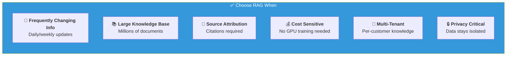

*Figure 2: Six scenarios where RAG is typically the preferred approach.*

**Frequently Changing Information:** When your knowledge base updates regularly (daily, weekly, or monthly), RAG allows instant updates by simply refreshing the document index. Fine-tuning would require retraining the model for each update.

**Large Knowledge Bases:** RAG can efficiently search millions of documents, far more information than could be encoded in model weights. The model retrieves only what's needed for each query.

**Source Attribution Requirements:** RAG naturally supports citations and source attribution since answers are generated from specific retrieved passages. This is crucial for applications requiring traceability and verification.

**Cost Sensitivity:** RAG requires no GPU-intensive training. You can use off-the-shelf embedding models and inference APIs, making it accessible with limited compute budgets.

**Multi-Tenant Applications:** When serving multiple customers with different knowledge bases, RAG allows per-tenant document collections without training separate models.

**Privacy and Data Isolation:** Sensitive documents can remain in secure, isolated retrieval systems rather than being absorbed into shareable model weights.

---

## When to Choose Fine-Tuning

Fine-tuning is more appropriate when:

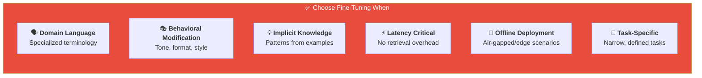

*Figure 3: Six scenarios where fine-tuning is typically the preferred approach.*

**Learning Domain Language:** If your domain uses specialized terminology, jargon, or writing styles, fine-tuning helps the model understand and generate appropriate language patterns.

**Behavioral Modification:** When you need to change how the model responds (tone, format, reasoning style), fine-tuning directly optimizes for these behaviors.

**Implicit Knowledge:** Some knowledge is better expressed through examples than explicit documents. Fine-tuning on input-output pairs can teach complex patterns.

**Latency Requirements:** Fine-tuned models generate answers directly without retrieval overhead. For real-time applications where every millisecond matters, eliminating retrieval can be valuable.

**Offline Deployment:** In air-gapped or edge deployment scenarios without access to vector databases, a fine-tuned model contains all necessary knowledge internally.

**Task-Specific Optimization:** For narrow tasks (classification, extraction, specific QA formats), fine-tuning can achieve superior performance compared to prompting general models.

---

## Knowledge Freshness and Updates

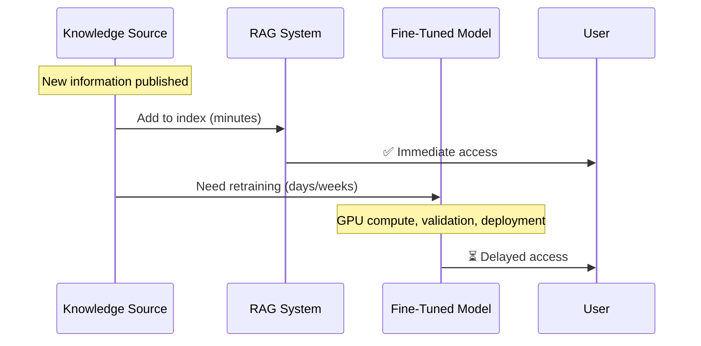

*Figure 4: Sequence diagram showing how RAG enables immediate knowledge updates while fine-tuning requires retraining.*

**RAG Advantage:** Updating a RAG system is as simple as adding or replacing documents in the index. Changes propagate immediately without any model retraining. This makes RAG ideal for knowledge that changes frequently or needs real-time accuracy.

**Fine-Tuning Challenge:** Updating a fine-tuned model requires retraining, which involves computational cost, potential catastrophic forgetting (losing previously learned knowledge), and validation of the new model. Most organizations retrain fine-tuned models on schedules (monthly, quarterly) rather than continuously.

**Practical Implication:** For a customer support chatbot where product details change weekly, RAG is clearly superior. For a model learning consistent legal reasoning patterns that rarely change, fine-tuning may be appropriate.

---

## Accuracy and Hallucination

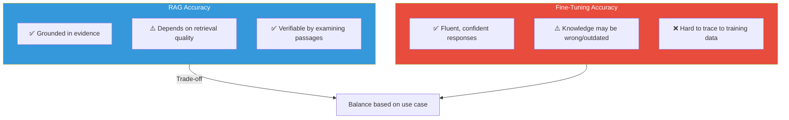

*Figure 5: Accuracy and hallucination characteristics comparison between RAG and fine-tuning approaches.*

**RAG Characteristics:** RAG grounds responses in retrieved evidence, which can reduce hallucination when retrieval is successful. However, if retrieval fails (query-document mismatch, relevant information not in corpus), the model may hallucinate or produce incomplete answers. RAG accuracy depends heavily on retrieval quality.

**Fine-Tuning Characteristics:** Fine-tuned models have knowledge encoded in weights, enabling fluent responses without retrieval. However, this knowledge can be wrong (training data errors), outdated, or incorrectly recalled. Fine-tuned models can confidently state incorrect information.

**Measurement:** RAG systems allow verification by examining retrieved passages. Fine-tuned model outputs are harder to trace back to training examples.

---

## Cost Analysis

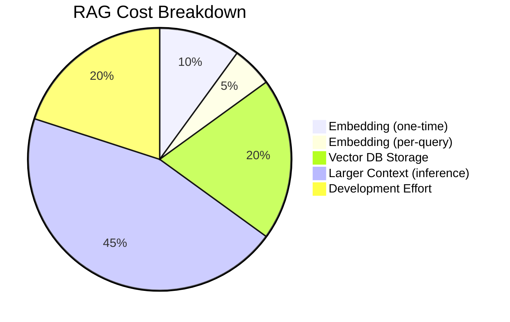

*Figure 6: Typical cost breakdown for RAG systems, dominated by inference costs from larger context windows.*

### RAG Costs
- Embedding computation (one-time for corpus, per-query for queries)
- Vector database storage and operations
- Larger context windows during inference (retrieved text increases prompt length)
- Development effort for chunking, indexing, and retrieval optimization

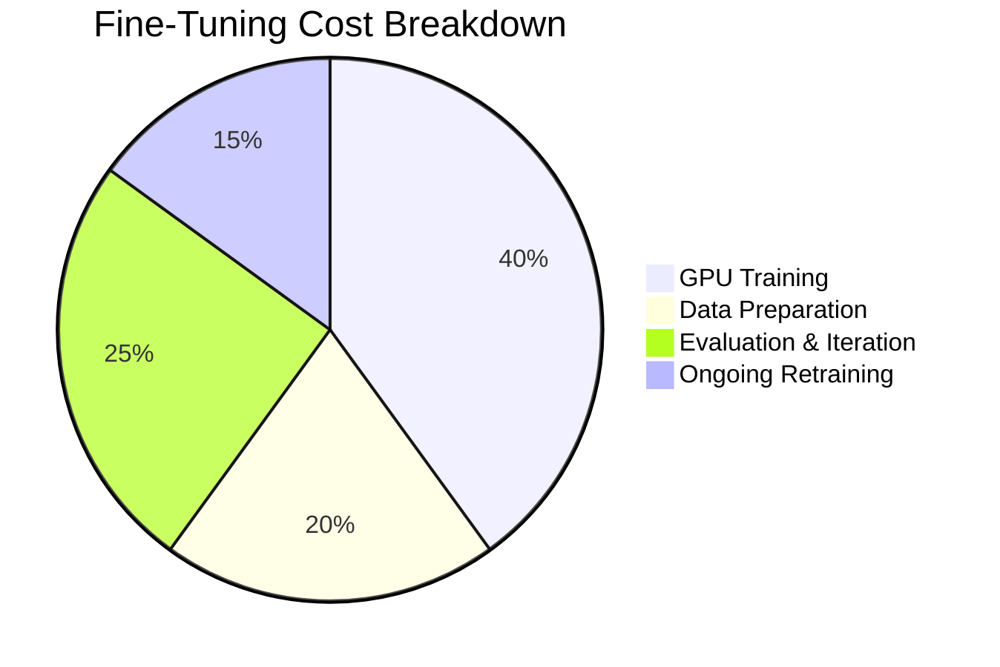

*Figure 7: Typical cost breakdown for fine-tuning, dominated by GPU training compute.*

### Fine-Tuning Costs
- GPU compute for training (can range from $10 for small models to $100K+ for large models)
- Data preparation and curation
- Evaluation and iteration cycles
- Ongoing retraining as requirements change

### Break-Even Analysis

| Scenario | Winner |
|----------|--------|
| Frequently changing knowledge | **RAG** (lower update cost) |
| Stable knowledge, high volume | **Fine-Tuning** (lower per-query cost) |
| Limited budget | **RAG** (no training compute) |
| Edge deployment | **Fine-Tuning** (no infrastructure) |

---

## Scalability Considerations

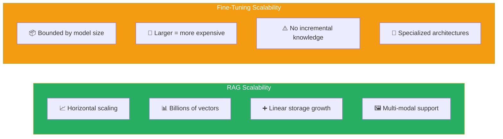

*Figure 8: Scalability characteristics comparison showing RAG's horizontal scaling vs fine-tuning's model-bound limits.*

**RAG Scalability:** Vector databases scale horizontally. Modern systems handle billions of vectors with sub-second retrieval. Adding more knowledge means adding more vectors, with linear storage growth.

**Fine-Tuning Scalability:** Knowledge capacity is bounded by model size. Larger models can store more knowledge but cost more to serve. There's no clear way to incrementally add knowledge without risking disruption to existing capabilities.

**Multi-Modal Knowledge:** RAG can incorporate images, tables, and structured data by converting them to appropriate representations. Fine-tuning on multi-modal data requires specialized architectures and training procedures.

---

## The Hybrid Approach

Many production systems combine both approaches:

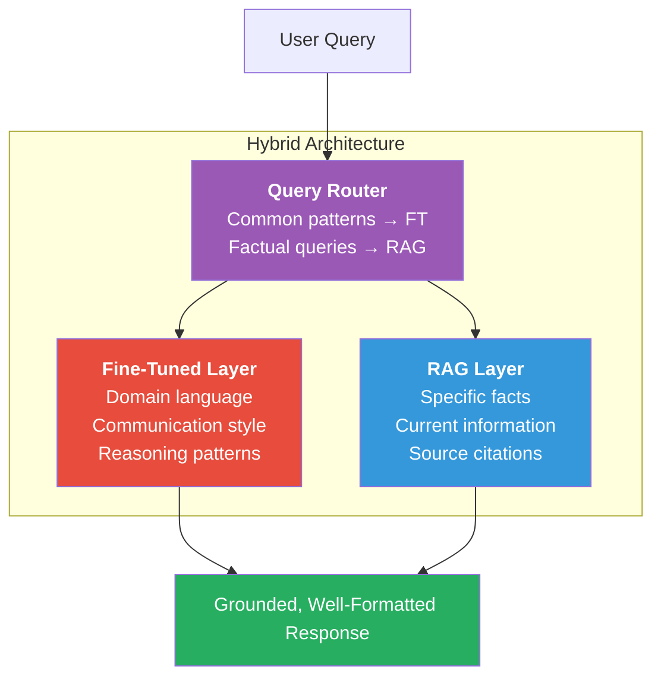

*Figure 9: Hybrid architecture combining fine-tuned behavior with RAG-based factual retrieval through intelligent routing.*

**Fine-Tune for Behavior, RAG for Facts:** Fine-tune the model to understand domain language, adopt appropriate tone, and reason correctly. Use RAG to provide specific facts, figures, and references.

**RAG-Aware Fine-Tuning:** Fine-tune the model specifically for RAG scenarios, training it to effectively use retrieved context and know when retrieval is insufficient.

**Routing Between Approaches:** Use a classifier to route queries to fine-tuned responses (for common patterns) or RAG (for specific factual queries).

**Example Hybrid Architecture:** A medical AI assistant is fine-tuned on medical conversations to understand terminology and maintain appropriate clinical communication style. RAG retrieves from drug databases, clinical guidelines, and medical literature to provide accurate, current information.

---

## Implementation Complexity

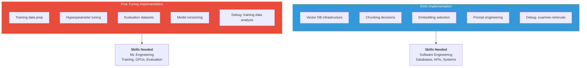

*Figure 10: Implementation complexity and team skills required for RAG vs fine-tuning approaches.*

### RAG Complexity
- Requires vector database infrastructure
- Chunking and preprocessing decisions significantly impact quality
- Embedding model selection affects retrieval accuracy
- Prompt engineering for effective context utilization
- Debugging requires examining retrieval results

### Fine-Tuning Complexity
- Requires training data preparation
- Hyperparameter tuning and training monitoring
- Evaluation dataset creation
- Managing model versions and deployments
- Debugging requires examining training data and model behavior

**Team Skills:** RAG development aligns with traditional software engineering (databases, APIs, systems). Fine-tuning requires ML engineering expertise (training pipelines, GPU optimization, evaluation).

---

## Case Studies and Recommendations

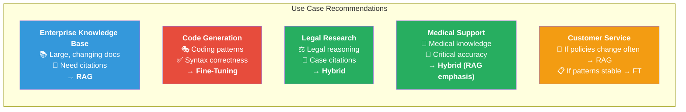

*Figure 11: Use case recommendations showing which approach best fits common application scenarios.*

**Enterprise Knowledge Base Chatbot:** Choose RAG. Documents change frequently, users need source citations, and the knowledge base is large and diverse.

**Code Generation Assistant:** Choose Fine-Tuning. The model needs to understand coding patterns and generate syntactically correct code. Behavior modification is the primary goal.

**Legal Research Assistant:** Choose Hybrid. Fine-tune for legal reasoning patterns and citation style. Use RAG to retrieve relevant cases, statutes, and regulations.

**Customer Service Bot (Narrow Domain):** Could go either way. If products/policies change often, RAG. If interactions follow consistent patterns, fine-tuning.

**Medical Diagnosis Support:** Choose Hybrid with strong RAG emphasis. Medical knowledge changes, source attribution is critical, but the model also needs to understand medical reasoning patterns.

---

## Decision Framework Summary

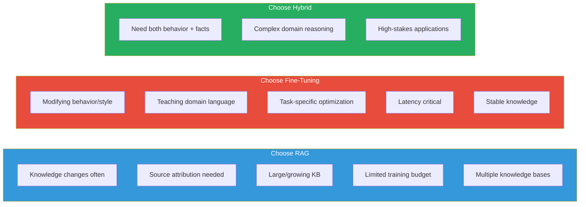

*Figure 12: Decision framework summary showing key criteria for choosing between RAG, fine-tuning, and hybrid approaches.*

### Choose RAG when:
- Knowledge changes frequently
- Source attribution is required
- Knowledge base is large or growing
- Budget for training is limited
- Multiple knowledge bases needed

### Choose Fine-Tuning when:
- Modifying model behavior/style
- Teaching domain language
- Optimizing for specific tasks
- Latency is critical
- Knowledge is stable

### Choose Hybrid when:
- Need both behavioral changes and factual accuracy
- Complex domain requiring specialized reasoning
- High-stakes applications requiring both reliability and groundedness

---

## Conclusion

The RAG vs fine-tuning decision is not binary. Understanding the strengths and limitations of each approach enables practitioners to design systems that leverage both as appropriate. As the field evolves, we see increasing sophistication in hybrid approaches and tools that make combining these techniques more accessible. The key is matching the approach to your specific requirements for freshness, accuracy, cost, and maintainability.
